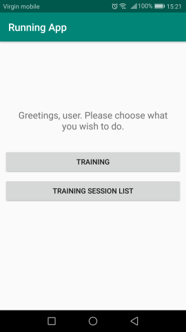
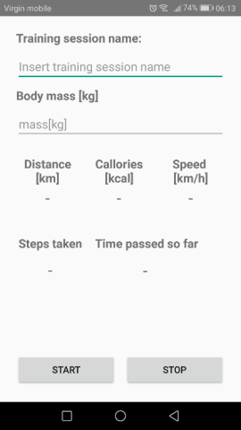
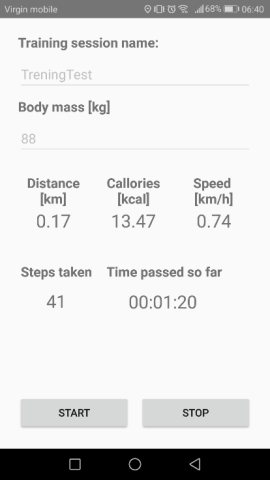
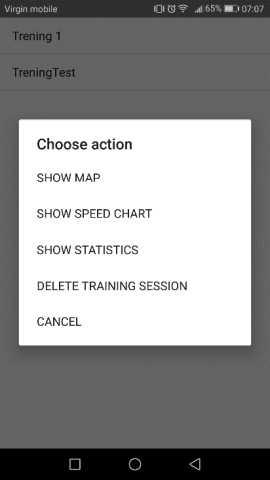
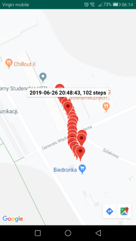
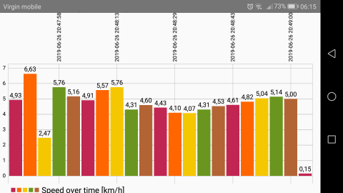
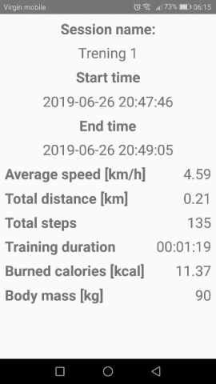

# RunningApp

## Purpose of this app
This app enables users to create statistics regarding their training sessions. Statistics are based on data collected from smartphone' GPS receiver and step counter.

The app provides following functionalities:

1. Collecting data such as:
* training start and end time,
* average speed (km/h),
* covered distance (km),
* number of steps,
* estimated number of burned calories (kcal),
* user's body mass (kg).

2. Displaying a chart with running speed during training.
3. Displaying a map that shows a route taken during the training.
4. Live display of parameters such as average speed, training time, number of steps, etc. during the training session.

## Utilized technologies

* Minimum  Android Version  - Android 7.0,
* Android Studio,
* Google Firebase Realtime Database,
* Java 8,
* MPAndroidChart for displaying speed charts mentioned i previous section.
## Short overview

